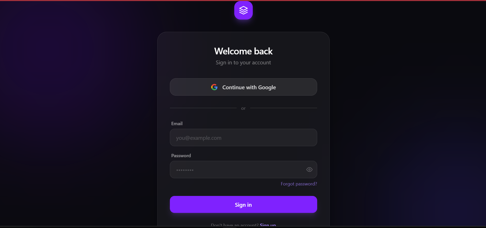
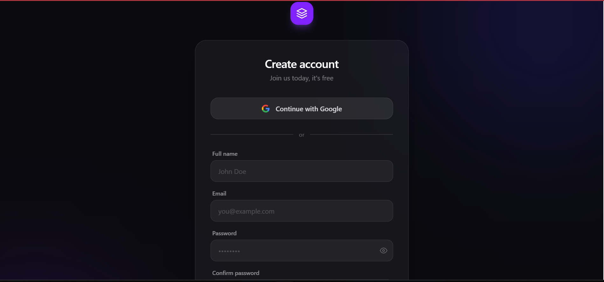
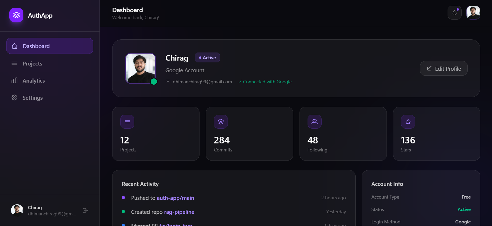

# 🔐 AuthFlow — Full Stack Authentication App

> A production-ready authentication system built with the MERN stack featuring JWT, Google OAuth, and real-time email notifications.

[](https://auth-flow2.netlify.app)
[](https://auth-app-backend-09tp.onrender.com)
[](LICENSE)

---

## 🚀 Live Demo

🌐 **Frontend:** [https://auth-flow2.netlify.app](https://auth-flow2.netlify.app)  
⚙️ **Backend API:** [https://auth-app-backend-09tp.onrender.com](https://auth-app-backend-09tp.onrender.com)

---

## ✨ Features

- 🔑 **Email & Password Authentication** — Secure signup/login with JWT tokens
- 🌐 **Google OAuth 2.0** — One-click sign in with Google account
- 🛡️ **Protected Routes** — JWT-based route protection on both frontend and backend
- 🔒 **Password Hashing** — bcrypt encryption — plain passwords never stored
- 📱 **Fully Responsive** — Works perfectly on mobile, tablet, and desktop
- 🎨 **Modern Dark UI** — Glassmorphism design with smooth animations
- 👤 **User Dashboard** — Real-time profile with Google avatar support

---

## 🛠️ Tech Stack

### Frontend
| Technology | Purpose |
|-----------|---------|
| React 19 | UI Library |
| Tailwind CSS 4 | Styling |
| React Router DOM | Client-side routing |
| Axios | HTTP requests |
| React Hot Toast |
| Vite | Build tool |

### Backend
| Technology | Purpose |
|-----------|---------|
| Node.js | Runtime |
| Express.js | Web framework |
| MongoDB + Mongoose | Database & ODM |
| JWT (jsonwebtoken) | Authentication tokens |
| bcrypt | Password hashing |
| Passport.js | Google OAuth strategy |

### Deployment
| Service | Purpose |
|---------|---------|
| Netlify | Frontend hosting |
| Render | Backend hosting |
| MongoDB Atlas | Cloud database |

---
## 📸 Screenshots

### 🔑 Login Page


### 📝 Signup Page


### 🏠 Dashboard


---

## 🏗️ Architecture

```
┌─────────────────┐         ┌─────────────────┐         ┌─────────────────┐
│                 │  HTTPS  │                 │  Query  │                 │
│   React App     │ ──────► │  Express API    │ ──────► │  MongoDB Atlas  │
│   (Netlify)     │ ◄────── │  (Render)       │ ◄────── │                 │
│                 │  JSON   │                 │  Data   │                 │
└─────────────────┘         └─────────────────┘         └─────────────────┘
                                    │
                                    │ OAuth
                                    ▼
                             ┌─────────────┐
                             │  Google     │
                             │  OAuth 2.0  │
                             └─────────────┘
```

---

## ⚡ Getting Started

### Prerequisites
- Node.js 18+
- MongoDB Atlas account
- Google Cloud Console project (for OAuth)
- Gmail account (for Nodemailer)

### 1. Clone the repository

```bash
git clone https://github.com/chiragdhiman99/auth-app-frontend.git
cd auth-app-frontend
```

### 2. Install dependencies

```bash
npm install --legacy-peer-deps
```

### 3. Create `.env` file

```env
VITE_API_URL=http://localhost:5000
```

### 4. Run the development server

```bash
npm run dev
```

App will be available at `http://localhost:5173`

---

## 🔌 API Endpoints

| Method | Endpoint | Description | Auth Required |
|--------|----------|-------------|---------------|
| POST | `/api/auth/signup` | Register new user | ❌ |
| POST | `/api/auth/login` | Login with email/password | ❌ |
| GET | `/api/auth/google` | Initiate Google OAuth | ❌ |
| GET | `/api/auth/google/callback` | Google OAuth callback | ❌ |
| GET | `/api/auth/me` | Get current user profile | ✅ |

---

## 🔐 Authentication Flow

```
Email/Password:
User → Signup Form → bcrypt hash → MongoDB → JWT Token → Dashboard

Google OAuth:
User → Google Button → Google Auth → Callback → JWT Token → Dashboard
```

---

## 📁 Project Structure

```
frontend/
├── public/
│   └── _redirects          # Netlify SPA routing fix
├── src/
│   ├── components/
│   │   └── ProtectedRoute.jsx   # JWT route guard
│   ├── pages/
│   │   ├── Login.jsx            # Login page
│   │   ├── Signup.jsx           # Signup page
│   │   └── Dashboard.jsx        # Protected dashboard
│   ├── App.jsx                  # Routes configuration
│   └── main.jsx                 # Entry point
├── package.json
└── vite.config.js
```

---

## 🌟 Key Implementation Highlights

### JWT Protected Routes
```jsx
const ProtectedRoute = ({ children }) => {
  const token = localStorage.getItem('token')
  if (!token) return <Navigate to="/login" />
  return children
}
```

### Google OAuth Integration
```javascript
// One-click Google login
window.location.href = `${API_URL}/api/auth/google`
// Backend handles OAuth flow and returns JWT token
```

### Password Strength Indicator
Real-time password strength validation with visual feedback (Weak → Strong)

---

## 🚀 Deployment

### Frontend (Netlify)
```bash
npm run build
# Deploy dist/ folder to Netlify
# Add _redirects file for SPA routing
```

### Environment Variables (Production)
Set these in your hosting platform:
```
VITE_API_URL=https://your-backend.onrender.com
```

---

## 👨‍💻 Author

**Chirag Dhiman**  
📍 Himachal Pradesh, India  
📧 dhimanchirag99@gmail.com  
🐙 [GitHub](https://github.com/chiragdhiman99)

---

## 📄 License

This project is licensed under the MIT License.

---

⭐ **If you found this helpful, please give it a star!**
